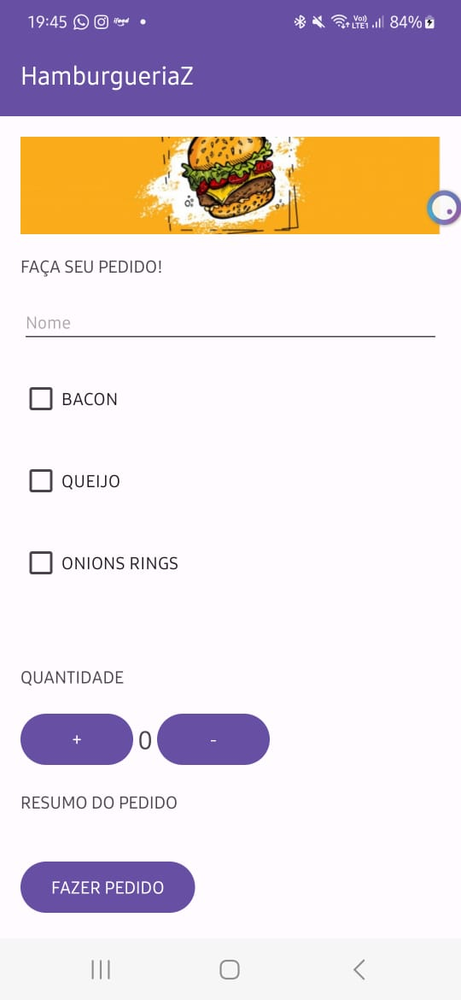

# HamburgueriaZ_android

Este projeto foi criado para a faculdade, o objetivo é criar um aplicativo android, utilizando Java,  para uma hamburgueria, de modo que os clientes possam realizar os seus pedidos diretamente pelo App.w


## Visão Geral
| Tela Inicial | Pedido | Envio do pedido | E-mail |
|----------|----------|----------|----------|
|  |  |  |  |

## Como rodar o projeto

### Clonar o Repositório

1. Crie uma pasta para salvar o projeto

2. Dentro da pasta criada, faça um clone do repositório usando o seguinte comando:
```git clone https://github.com/TaisaBraga/HamburgueriaZ_android.git```

### Configurar o ambiente

1. Certifique-se de ter o android studio instalado em sua máquina. Se você ainda não o tem, você pode baixar em ([https://developer.android.com/](https://developer.android.com/studio)).
2. Abra o aplicativo no Android Studio
3. Conecte um celular android no computador
4. No Android studio, clique em 'run app'
